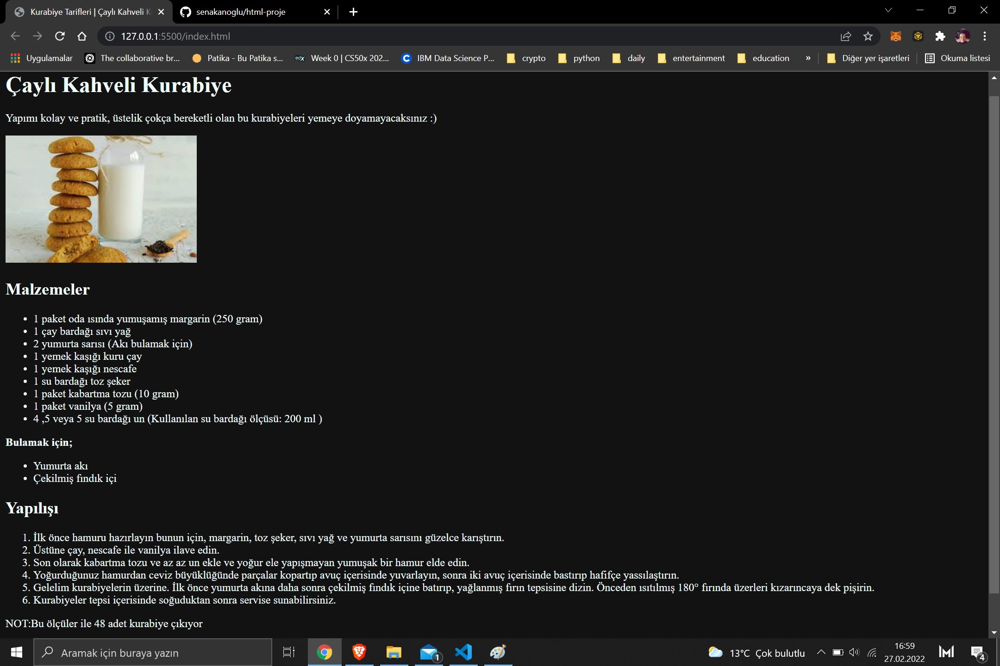

# HTML Bölüm Sonu Projesi
Bu repo [Kodluyoruz](https://www.kodluyoruz.org) Front-End HTML eğitimi bitiminde oluşturduğumuz bir adet yemek tarifi içeren HTML sayfasıdır. İçerisinde bir adet README dosyası,iki adet imaj dosyası ve bir adet index.html barındırıyor.



## Installation
Öncelikle projeyi clonelayın. (Buraya sizin reponuzdan aldığınız link gelecek)

`https://github.com/senakanoglu/html-proje.git`

## Usage

Projeyi cloneladıktan sonra Visual Studio Code programında açınız.

Linux için:
```
cd kodluyoruzilkrepo
code .
```
## Contributing

Pull requestler kabul edilir. Büyük değişiklikler için, lütfen önce neyi değiştirmek istediğinizi tartışmak için bir konu açınız.

